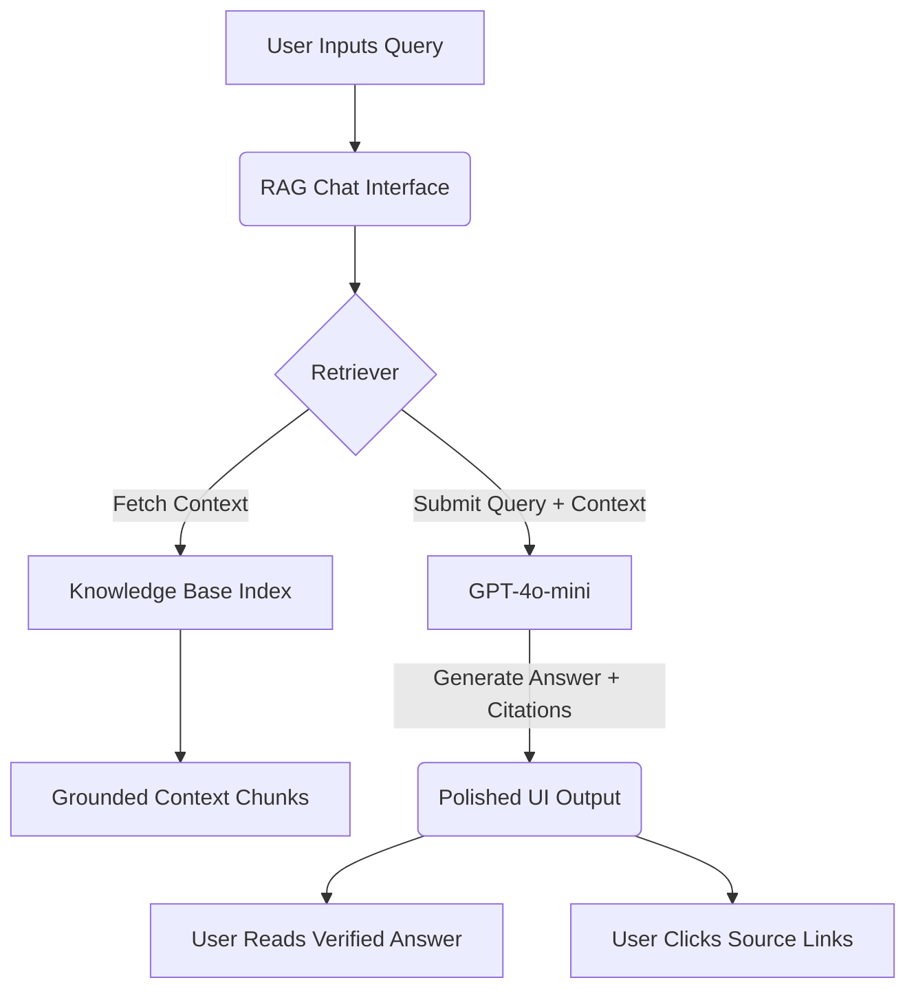

# DAU PWA - Demo Flow and Scenarios
This document maps out the interaction paths and visual flow for the live demonstration of the DAU RAG Assistant.

---

## 🗺️ Live Demo Architecture Flow

---

## 🎬 Demo Scenario 1: The "New Student" Onboarding Flow
* **Target Audience:** Incoming freshmen, parents, and administrative visitors.
* **Goal:** Showcase the assistant's ability to answer multi-faceted questions about campus rules, locations, and academic requirements.

### Steps:
1. **Initiation:** Presenter opens the chat interface on a mobile or tablet viewport (since this is a PWA).
2. **Query 1:** Ask about NAAC Accreditation to establish trust:
   > *"What NAAC accreditation grade does Dhirubhai Ambani University hold?"*
3. **Observation:** Highlight the speed of the answer, and point out the NAAC A+ details and the source link (`https://www.daiict.ac.in/about-us`).
4. **Query 2:** Follow up with hostel guidelines:
   > *"Can you tell me about the hostel room rules and guest policies?"*
5. **Observation:** Note how the system retrieves the official PDF-derived markdown source (`data/student_services/daiict_ac_in_sites_default_files_other_files_hostel_rules_and_regulations_pdf.md`) and formats the bullet points cleanly.
6. **Wrap-up:** Point out that the student got verified information in seconds instead of browsing through deep file directories.

---

## 🎬 Demo Scenario 2: The "Course Selection" Flow
* **Target Audience:** Current undergraduate students preparing for registration.
* **Goal:** Showcase the assistant's ability to look up deep curriculum structures and program core requirements.

### Steps:
1. **Query 1:** Ask about the CSAI curriculum structure:
   > *"What are the core subjects required in the B.Tech CSAI program?"*
2. **Observation:** Point out the detailed list of subjects, semester breakdowns, and elective options fetched from `https://www.daiict.ac.in/btech-csai`.
3. **Query 2:** Check course prerequisites or specific topics:
   > *"What AI applications electives are available for B.Tech CSAI students?"*
4. **Observation:** Note that the AI lists Natural Language Processing, Computer Vision, LLMs, and Robotics with direct citation references.

---

## 🎬 Demo Scenario 3: The "Research Opportunity" Flow
* **Target Audience:** Students looking for research internships or faculty guides.
* **Goal:** Demonstrate cross-referencing between faculty profiles and active sponsored research projects.

### Steps:
1. **Query 1:** Find active research:
   > *"What sponsored research projects are currently active at DAU?"*
2. **Observation:** View the list of active projects funded by agencies like DST, ISRO, and MeitY.
3. **Query 2:** Look up the faculty profile of one of the PIs:
   > *"What are the research areas and contact info of Professor Abhishek Gupta?"*
4. **Observation:** Highlight how the assistant pulls information from the specific faculty file under regular faculty, showing the email and phone extensions along with matching research fields.

---

## 🛠️ Offline & Graceful Degradation Demo (PWA Showcase)
* **Goal:** Demonstrate next-generation PWA features.
* **Scenario:** The presenter disconnects from the internet (simulated or real offline mode).
* **Action:** Type a query that has been cached, showing the application's responsive offline UI and localized fallbacks instead of crashing or showing a blank page.
