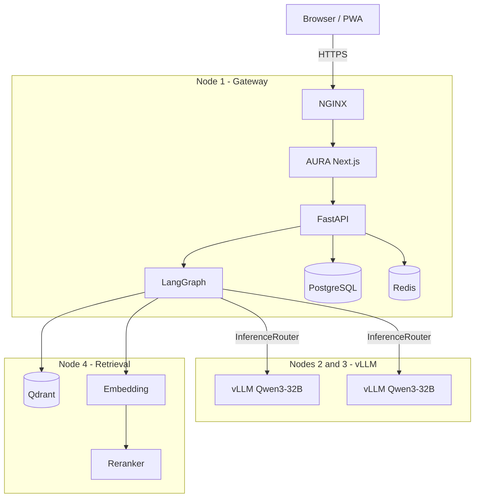

##  Aura Architecture Overview

AURA is an agentic RAG system: the PWA talks to a FastAPI gateway, LangGraph orchestrates retrieval and inference, and GPU nodes serve the LLM.



Production multi-node layout, compose files, and CD: [`.github/deploy/README.md`](./.github/deploy/README.md).

---

## Getting Started

### Prerequisites

- **Node.js** 20+ and **npm** (frontend)
- **Python** 3.14+ (backend)

### 1. Fork & clone

Fork the repo on GitHub, then clone your fork:

```bash
git clone https://github.com/<your-username>/DAU-pwa.git
cd DAU-pwa
```

Add the upstream remote so you can pull future changes:

```bash
git remote add upstream https://github.com/ossdaiict/DAU-pwa.git
```

### 2. Run the frontend

```bash
cd aura
npm install
cp .env.example .env.local   # fill in the documented values
npm dev                     # http://localhost:3000
```

### 3. Run the backend

```bash
cd server/rag
cp .env.example .env         # fill AUTH_DB_URL, GROQ, Pinecone, JWT secrets
python -m venv venv
source venv/bin/activate
pip install -r requirements.txt
cd ..
python db/migrate.py
uvicorn api.api:app --host 127.0.0.1 --port 8000 --reload
```

---

## Branch Naming

All work happens on personal feature branches — **never commit directly to `main`**.


Create your branch from the latest `main`:

```bash
git fetch upstream
git checkout -b <name>/<feature> upstream/main
```

---

## Making Changes

Keep changes scoped to your feature. Each domain is owned by a sub-team — don't edit files outside your area without coordinating first.

| Domain | Owns |
|--------|------|
| Frontend | `aura/app/`, `aura/components/`, `aura/hooks/` |
| Backend / Infra | `server/api/`, `server/db/`, CI/CD |
| Agents | `server/rag/`, prompt engineering, model evaluation |

---

## Commit Format

Follow [Conventional Commits](https://www.conventionalcommits.org/):

```
<type>(<scope>): <short description>
```

Examples:

```
feat(auth): add OTP login via university email
fix(dashboard): correct timetable timezone offset
perf(ai): enable prompt caching on search handler
```

Subject line must be 72 characters or fewer. For `fix` commits, add a body explaining the root cause.

---

## Opening a Pull Request

1. Push your branch to your fork:

   ```bash
   git push origin <name>/<feature>
   ```

2. Open a PR on GitHub targeting the **`main`** branch.

3. Fill in the PR template: summary, test plan, and screenshots for any UI changes.

4. Link the related issue: `Closes #<issue-number>`.

5. Request a review. Merging into `main` requires **at least 1 approval**.

PRs are **squash-merged** into `main`. Direct pushes to `main` are blocked.

---

## Further Reading

- [`CLAUDE.md`](./CLAUDE.md) — full coding rules and conventions
- [`AGENTS.md`](./AGENTS.md) — guidelines for AI coding agents on this project

---

## Credits

Built with ❤️ by **GDG On Campus** and the **AI Club** of Dhirubhai Ambani University, under the supervision of **[Prof. Arpit Rana](https://www.linkedin.com/in/arpitrana/)**.
