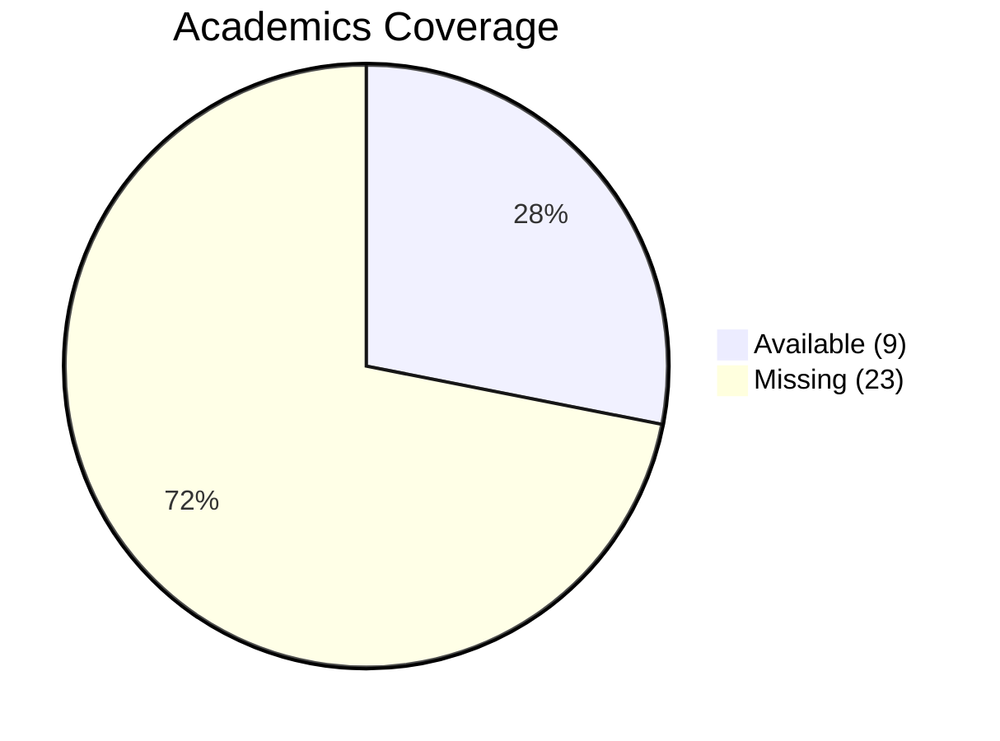

# Academics Cluster Coverage Map

**Purpose:** Measure what information is available and missing across the 4 layers of the Academics domain.
**Cluster Owner:** Academics Team

## Coverage Summary

*   **Total Topics:** 32
*   **Available Topics:** 9
*   **Missing Topics:** 23
*   **Coverage Score:** 28.1%

---

## Layer 1: Information Available (Collected / Static)
This layer contains foundational, static information mapped to our new organized directories.

| Topic | Status | Primary Source Path |
| :--- | :--- | :--- |
| Curriculum & Program Structure | Available | `policies/academic_policy_academic_requirements_*.md` |
| Courses & Subjects Information | Available | `courses/course_policy_*.md` |
| Credit Structure | Available | `courses/course_policy_andcreditstructure_*.md` |
| Degree Requirements | Available | `policies/academic_policy_academic_requirements_*.md` |
| Syllabus Information | Available | `courses/course_policy_*.md` |
| Course Outlines | Available | `courses/course_policy_*.md` |
| Academic Regulations & Policies | Available | `policies/academic_policy_*.md` |

## Layer 2: Dynamic / Continuously Updating Information
This layer involves information that changes regularly and requires automated updates.

| Topic | Status | Primary Source Path |
| :--- | :--- | :--- |
| Academic Calendar | Available | `academic_calendar/` directory |
| Registration Dates & Deadlines | Available | `policies/academic_policy_registration_*.md` |
| Exam Schedules & Hall Allotments | Available | `policies/academic_policy_*_exam_schedule_*.md` |
| Current Semester Course Offerings | Missing | - |
| Timetable & Class Schedules | Missing | - |
| Elective Availability | Missing | - |
| Results & Grade Updates | Missing | - |
| Add/Drop Periods | Missing | - |
| Academic Announcements | Missing | - |
| Classroom Changes | Missing | - |
| Course Difficulty & Workload Insights | Missing | - |

## Layer 3: Information from Committees, Admin, Faculty & Students
Human-provided knowledge collected through various departments and stakeholders.

| Topic | Status | Primary Source Path |
| :--- | :--- | :--- |
| Faculty Insights & Subject Recommendations | Missing | - |
| Department Notice Board Updates | Missing | - |
| Best Electives Based on Past Experience | Missing | - |
| Learning Analytics & Performance Insights | Missing | - |
| Internship / Research Opportunities | Missing | - |
| Industry Connects & Guest Lectures Info | Missing | - |
| Course Recommendation Engine | Missing | - |
| Student Feedback & Reviews | Missing | - |
| Mentorship Decisions & Sessions Info | Missing | - |
| Academic Advising Committee Inputs | Missing | - |

## Layer 4: Future Integrations & Automation
Information that will come from deep system integrations (APIs).

| Topic | Status | Primary Source Path |
| :--- | :--- | :--- |
| ERP Integration | Missing | - |
| LMS Integration | Missing | - |
| Digital Document Repository | Missing | - |
| Smart Notifications & Personalized Alerts | Missing | - |
