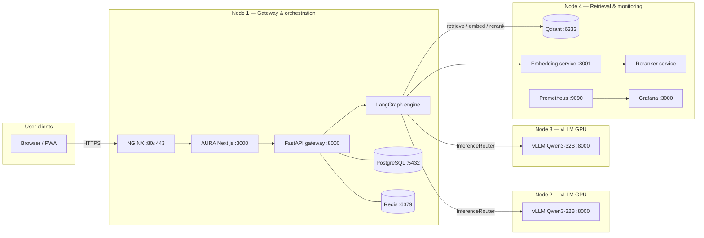

# AURA Production Multi-Node Deployment Topology

This directory contains the production deployment manifests for the **AURA Distributed Cluster** across 4 Ubuntu Nodes using Docker Compose.

---

## Architecture



---

## Directory Layout

```
deploy/
├── node1/                     # Node 1: NGINX, Next.js (PWA), FastAPI + LangGraph, Postgres, Redis
│   ├── docker-compose.yml
│   └── .env.node1.example
├── node2/                     # Node 2: vLLM GPU Node 1
│   ├── docker-compose.yml
│   └── .env.node2.example
├── node3/                     # Node 3: vLLM GPU Node 2
│   ├── docker-compose.yml
│   └── .env.node3.example
├── node4/                     # Node 4: Search Engine (Qdrant, Embedding/Reranker) + Monitoring (Prometheus, Grafana)
│   ├── docker-compose.yml
│   └── .env.node4.example
├── nginx/                     # Reverse Proxy & SSL Configuration
│   └── nginx.conf
├── scripts/                   # CD helpers (Node 1 apps + remote Nodes 2–4)
│   ├── deploy-apps.sh         # Node 1: aura + backend + nginx only
│   ├── deploy-node2.sh        # rsync → Node 2 (vLLM restart opt-in)
│   ├── deploy-node3.sh        # rsync → Node 3 (vLLM restart opt-in)
│   ├── deploy-node4.sh        # rsync → Node 4; recreate prometheus/grafana
│   ├── deploy-cluster.sh      # Orchestrator (apps + optional remotes)
│   ├── install-actions-runner.sh
│   └── lib/remote.sh          # Shared SSH/rsync helpers
└── monitoring/                # Prometheus & Grafana Monitoring (bind-mounted on Node 4)
    ├── prometheus.yml
    └── grafana-datasource.yml
```

> **Important:** Editing files under `/opt/aura/app` on Node 1 does **not**
> automatically update Nodes 2–4. Remotes receive files only via
> `deploy-node{2,3,4}.sh` (rsync over SSH) or the Node 4 CD job.

---

## Quick Start Deployment Guide

### Node 4: Search Engine & Monitoring Stack (Start First)
On **Node 4**:
```bash
cd deploy/node4
cp .env.node4.example .env
# Edit .env and update Prometheus scrape targets in ../monitoring/prometheus.yml with actual LAN IPs!
docker compose up -d --build
```
*Exposes:* Qdrant on `:6333`, Embedding/Reranker service on `:8001`, Prometheus on `:9090`, and Grafana on `:3000`.

### Node 2 & Node 3: vLLM GPU Nodes
On **Node 2** (GPU Box 1):
```bash
cd deploy/node2
cp .env.node2.example .env
docker compose up -d
```
On **Node 3** (GPU Box 2):
```bash
cd deploy/node3
cp .env.node3.example .env
docker compose up -d
```
*Exposes:* OpenAI-compatible vLLM endpoints on port `:8000`.

### Node 1: Gateway & Orchestration Node
On **Node 1**:
```bash
cd deploy/node1
cp .env.node1.example .env
# Edit .env and replace <NODE_2_IP>, <NODE_3_IP>, <NODE_4_IP> with actual LAN IPs!
mkdir -p ../certs # add fullchain.pem / privkey.pem
docker compose up -d --build
```

---

## Multi-node sync from Node 1 (SSH + rsync)

Nodes 2–4 do **not** pull from GitHub themselves in the automated path. Node 1
rsyncs `deploy/` + `services/` over SSH, then runs targeted `docker compose`
commands on the remote. Remote `.env` files are never overwritten.

### One-time setup (cluster SSH)

On **Node 1**:

```bash
sudo mkdir -p /opt/aura/.ssh
sudo chown -R "$USER:$USER" /opt/aura
ssh-keygen -t ed25519 -f /opt/aura/.ssh/cluster_deploy -N ""
```

On **each of Nodes 2, 3, 4** (as the deploy user, default `aura`):

```bash
sudo mkdir -p /opt/aura/app
sudo chown -R "$USER:$USER" /opt/aura
# Install Node 1's public key for passwordless SSH:
#   (from Node 1) ssh-copy-id -i /opt/aura/.ssh/cluster_deploy.pub aura@<NODE_IP>
#   (use that node's login user if it differs — e.g. aura4)
```

Copy per-node env once (not managed by rsync):

```bash
# On Node 2 / 3 / 4 after the first rsync, or seed manually:
cd /opt/aura/app/deploy/nodeN
cp .env.nodeN.example .env
# edit .env
```

Add LAN hosts to Node 1’s env (`deploy/node1/.env`):

```bash
AURA_NODE2_HOST=<NODE_2_IP>
AURA_NODE3_HOST=<NODE_3_IP>
AURA_NODE4_HOST=<NODE_4_IP>
# optional overrides:
# AURA_SSH_USER=aura
# AURA_SSH_KEY=/opt/aura/.ssh/cluster_deploy
# AURA_REMOTE_APP_ROOT=/opt/aura/app
# Per-node SSH users only if they differ from AURA_SSH_USER:
# AURA_NODE2_SSH_USER=aura2
# AURA_NODE3_SSH_USER=aura3
# AURA_NODE4_SSH_USER=aura4
```

### After editing `deploy/monitoring/prometheus.yml`

On Node 1 (preferred after merge to `main`, or immediately for ops):

```bash
# Dry-run first
AURA_NODE4_HOST=<NODE_4_IP> /opt/aura/app/deploy/scripts/deploy-node4.sh --dry-run

# Sync + recreate prometheus + grafana only (Qdrant untouched)
AURA_NODE4_HOST=<NODE_4_IP> /opt/aura/app/deploy/scripts/deploy-node4.sh
```

Or push to `main` (paths under `deploy/monitoring/**` or `deploy/node4/**`) so
the CD job `deploy-node4-monitoring` runs on the `aura-node1` runner.

Optional: rebuild the embedding/reranker image without touching Qdrant:

```bash
./deploy/scripts/deploy-node4.sh --with-search
```

### Nodes 2 & 3 (vLLM)

```bash
# Sync compose files only — does NOT restart the GPU server
./deploy/scripts/deploy-node2.sh
./deploy/scripts/deploy-node3.sh

# Explicit cold recreate (use sparingly)
./deploy/scripts/deploy-node2.sh --restart-vllm
./deploy/scripts/deploy-node3.sh --restart-vllm
```

Orchestrator:

```bash
./deploy/scripts/deploy-cluster.sh --node4
./deploy/scripts/deploy-cluster.sh --all-safe main   # apps + node4 monitoring + node2/3 sync
```

---

## Auto-deploy (optional — Node 1 self-hosted runner)

One CD job plans targets from path changes (or a manual `target` input) and
runs `deploy-cluster.sh`:

| Target | CD action |
|--------|-----------|
| Node 1 apps | Rebuild `aura` + `backend`, refresh `nginx` |
| Node 2 / 3 | rsync `deploy/` + `services/` only (**no** vLLM restart) |
| Node 4 | rsync + recreate prometheus/grafana (**no** Qdrant / `--with-search`) |

**Never** restarts Postgres, Redis, Qdrant, or vLLM from CD.

### 1. Install the runner on Node 1

```bash
# On Node 1 — create dirs if needed
sudo mkdir -p /opt/aura/actions-runner /opt/aura/app
sudo chown -R "$USER:$USER" /opt/aura

# Clone once (if not already present)
git clone https://github.com/ossdaiict/DAU-pwa.git /opt/aura/app

# Node 1 compose env (required for CD) — pick one:
cp /opt/aura/app/deploy/node1/.env.node1.example /opt/aura/app/deploy/node1/.env
# edit /opt/aura/app/deploy/node1/.env
# OR if you already keep secrets at /opt/aura/.env:
# ln -sfn /opt/aura/.env /opt/aura/app/deploy/node1/.env

# Registration token: GitHub → Settings → Actions → Runners → New self-hosted runner
export RUNNER_TOKEN=...          # short-lived
export GITHUB_REPO_URL=https://github.com/ossdaiict/DAU-pwa
/opt/aura/app/deploy/scripts/install-actions-runner.sh

# Prefer a systemd service so the runner survives reboot
cd /opt/aura/actions-runner
sudo ./svc.sh install
sudo ./svc.sh start
```
*Exposes:* OpenAI-compatible vLLM endpoints on port `:8000`.

The runner must be registered with label **`aura-node1`** (the install script
sets this). The CD workflow targets:

```yaml
runs-on: [self-hosted, Linux, aura-node1]
```

### Git auth on Node 1 (required)

CD runs headless. An HTTPS clone with no credentials fails with:

```text
fatal: could not read Username for 'https://github.com': No such device or address
```

**CD path (recommended):** the workflow passes a token into `deploy-apps.sh`
via an ephemeral `url.*.insteadOf` rewrite (never written into
`/opt/aura/app/.git/config`).

1. Prefer a **repository secret** named `AURA_DEPLOY_GIT_TOKEN` (PAT with
   Contents: Read on this repo).  
   GitHub → Settings → Secrets and variables → Actions → New repository secret.
2. If that secret is unset, CD falls back to the job’s built-in `github.token`.

Never put PATs in workflow YAML, git remotes, or `deploy/node1/.env`. If a
token was pasted into chat or a ticket, **revoke it immediately** and create a
new one.

**Manual deploys:** either export a fine-scoped PAT as `GITHUB_TOKEN` for that
shell, or switch the checkout to SSH with a **read-only deploy key**:

```bash
# On Node 1 (once)
ssh-keygen -t ed25519 -f /opt/aura/.ssh/github_deploy -N ""
# Add /opt/aura/.ssh/github_deploy.pub as a Deploy key (read-only) on the repo
cd /opt/aura/app
git remote set-url origin git@github.com:ossdaiict/DAU-pwa.git
GIT_SSH_COMMAND="ssh -i /opt/aura/.ssh/github_deploy -o IdentitiesOnly=yes" \
  git fetch --prune origin
```

Do **not** put `GITHUB_TOKEN` / PATs / `RUNNER_TOKEN` in `deploy/node1/.env`.

### 2. What CD runs

Workflow: [`.github/workflows/cd-auto-deploy.yml`](../.github/workflows/cd-auto-deploy.yml)

Single job `deploy-cluster` on `aura-node1`:

| Triggers | Action |
|----------|--------|
| `workflow_dispatch` target=`apps` / `node2` / `node3` / `node4` / `all-safe` | Deploy chosen scope |
| `push` to `main` touching `aura/**`, `server/**`, `deploy/node1/**`, … | Node 1 apps |
| `push` to `main` touching `deploy/node2/**`, … | Node 2 sync-only |
| `push` to `main` touching `deploy/node3/**`, … | Node 3 sync-only |
| `push` to `main` touching `deploy/node4/**`, `deploy/monitoring/**`, `services/**`, … | Node 4 monitoring |

Orchestrator: [`deploy/scripts/deploy-cluster.sh`](scripts/deploy-cluster.sh)

```bash
# Equivalent manual deploys on Node 1
/opt/aura/app/deploy/scripts/deploy-cluster.sh --all-safe main
/opt/aura/app/deploy/scripts/deploy-cluster.sh --apps main
/opt/aura/app/deploy/scripts/deploy-cluster.sh --node4
```

Set `AURA_NODE{2,3,4}_HOST` in `deploy/node1/.env` (or GitHub Actions variables).
Optional per-node SSH users: `AURA_NODE{2,3,4}_SSH_USER`.

`deploy-apps.sh` uses `docker compose up -d --build --no-deps aura backend` so
database containers are not touched. `deploy-node4.sh` uses
`--no-deps --force-recreate` for prometheus/grafana so Qdrant stays up.
Node 2/3 CD never passes `--restart-vllm`.

## Health Checks & Verification

On **Node 1**:
```bash
# Verify Gateway Health
curl -fsS https://localhost/backend/health

# Check logs to confirm multi-node connections
docker compose -f deploy/node1/docker-compose.yml logs backend | grep "InferenceRouter"
```

On **Node 4**:
```bash
# Verify Prometheus Scrape Targets
curl -fsS http://localhost:9090/-/healthy

# Verify Grafana
curl -fsS http://localhost:3000/api/health
```
